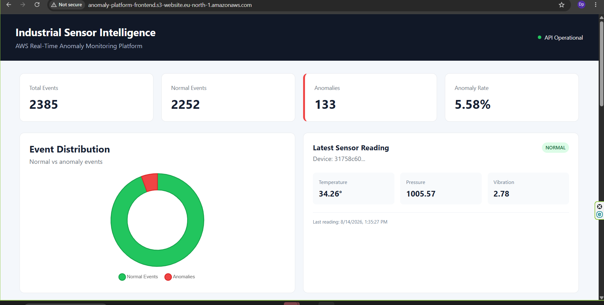
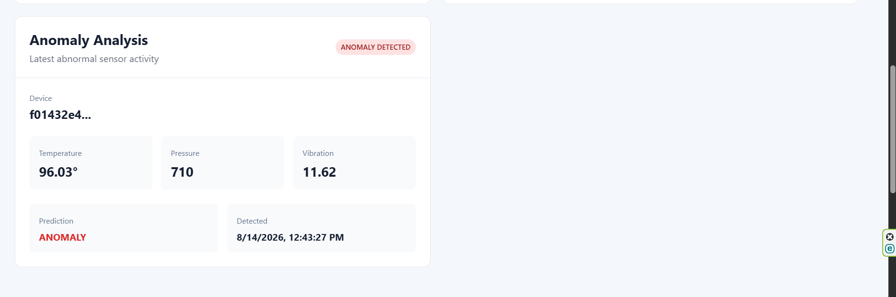
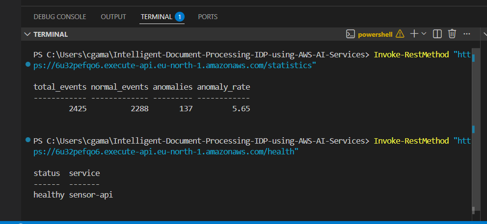
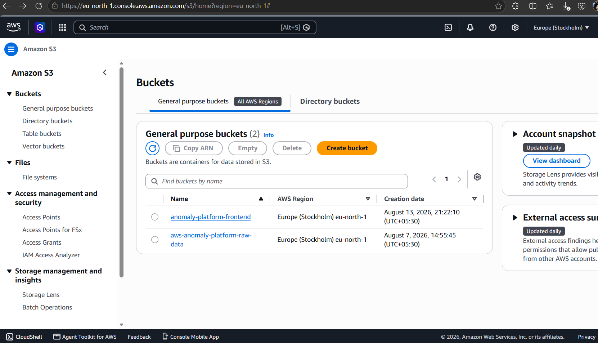
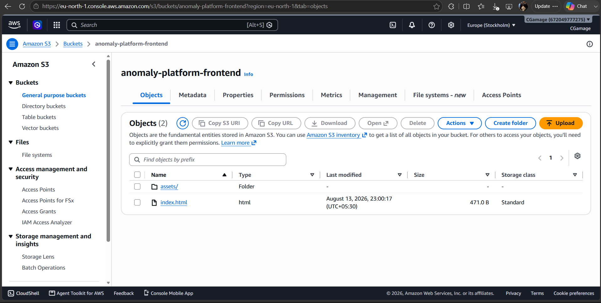
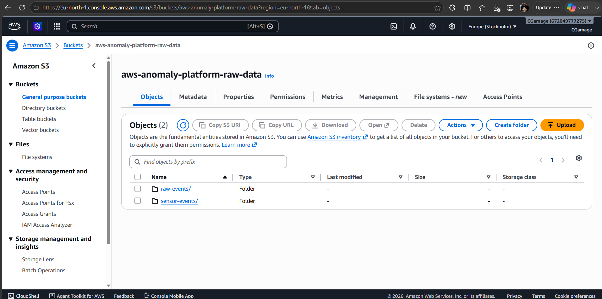

# Intelligent Sensor Anomaly Detection Platform

An end-to-end AWS-based IoT analytics platform that collects simulated sensor data, processes it through a serverless AWS pipeline, detects anomalous readings using a machine-learning model, stores results in DynamoDB, and exposes the processed data through an API-driven React dashboard.

The project demonstrates practical use of **AWS Lambda, Amazon S3, Amazon SQS, Amazon DynamoDB, Amazon API Gateway, IAM, Python, FastAPI/API services, React, Vite, and Tailwind CSS**.

## Live Application

**Deployement Link:**
http://anomaly-platform-frontend.s3-website.eu-north-1.amazonaws.com/

**API Gateway:**
`https://6u32pefqo6.execute-api.eu-north-1.amazonaws.com`

### API endpoints

```text
GET /health
GET /statistics
GET /events
```

The API is used by the deployed React dashboard to retrieve live health information, statistics, and recent sensor events.

---

## Project Overview

The platform simulates industrial sensor readings such as:

* Temperature
* Pressure
* Vibration
* Device ID
* Timestamp

The generated sensor data is processed through an AWS serverless architecture.

Normal sensor readings are classified as `NORMAL`, while abnormal combinations of temperature, pressure, and vibration are identified as `ANOMALY`.

The resulting events are stored and made available to the frontend dashboard through API Gateway.

---

## Architecture

```text
                    Sensor Data
                         │
                         ▼
              Sensor Generator / Simulator
                         │
                         ▼
                    Amazon SQS
                         │
                         ▼
                  AWS Lambda
                         │
              ┌──────────┴──────────┐
              │                     │
              ▼                     ▼
       ML Anomaly Model       Event Processing
              │                     │
              └──────────┬──────────┘
                         ▼
                 Amazon DynamoDB
                         │
                         ▼
                  API Lambda
                         │
                         ▼
                Amazon API Gateway
                         │
             ┌───────────┼───────────┐
             │           │           │
             ▼           ▼           ▼
          /health   /statistics   /events
                         │
                         ▼
                  React + Vite
                    Dashboard
                         │
                         ▼
                    Amazon S3
                 Static Web Hosting
```

### AWS services used

| Service                | Purpose                                             |
| ---------------------- | --------------------------------------------------- |
| **Amazon S3**          | Frontend static hosting and project data storage    |
| **AWS Lambda**         | Serverless sensor processing and API functionality  |
| **Amazon SQS**         | Queuing sensor messages between components          |
| **Amazon DynamoDB**    | Persistent storage for processed sensor events      |
| **Amazon API Gateway** | Public HTTP API for the frontend                    |
| **AWS IAM**            | Permissions and access control between AWS services |
| **Amazon CloudWatch**  | Lambda execution logs and operational visibility    |

---

## Repository Structure

```text
Intelligent-Document-Processing-IDP-using-AWS-AI-Services/
│
├── api-lambda/
│   ├── dynamodb_service.py
│   └── eav.json
│
├── backend/
│   ├── crud.py
│   ├── routers/
│   │   └── statistics.py
│   ├── anomaly_model.pkl
│   └── events.db
│
├── frontend/
│   ├── src/
│   │   ├── assets/
│   │   ├── components/
│   │   ├── services/
│   │   ├── index.css
│   │   └── ...
│   ├── index.html
│   ├── package.json
│   ├── package-lock.json
│   ├── vite.config.js
│   └── .env
│
├── lambda/
│   ├── requirements.txt
│   ├── dynamodb-policy.json
│   ├── s3-policy.json
│   ├── response.json
│   └── test-event.json
│
├── sensor-generator-lambda/
│   ├── sqs-policy.json
│   └── trust-policy.json
│
├── sensor-simulator/
│   └── ...
│
├── docs/
│   └── images/
│
└── .gitignore
```

> Some deployment configuration files and environment variables are intentionally excluded from Git for security.

---

# Features

## Sensor Data Generation

The system generates sensor readings containing:

```text
temperature
pressure
vibration
device_id
timestamp
```

The generated data includes both normal and deliberately abnormal readings to demonstrate anomaly detection.

## Machine Learning Anomaly Detection

The platform uses a trained anomaly-detection model to classify sensor readings.

Example:

```text
NORMAL
temperature: 36.6
pressure:    1005.75
vibration:   1.89
```

Example anomaly:

```text
ANOMALY
temperature: 112.08
pressure:    811.40
vibration:   12.77
```

The processed result is stored together with the original sensor information.

## REST API

The frontend communicates with the AWS API through API Gateway.

### Health

```http
GET /health
```

Example response:

```json
{
  "status": "healthy",
  "service": "sensor-api"
}
```

### Statistics

```http
GET /statistics
```

Example:

```json
{
  "total_events": 1347,
  "normal_events": 1269,
  "anomalies": 78
}
```

### Events

```http
GET /events
```

Returns processed sensor events for the dashboard.

---

# Frontend Dashboard

The React dashboard provides:

* API health status
* Total event statistics
* Normal event count
* Anomaly count
* Sensor charts
* Recent sensor event table
* Manual refresh
* Automatic data refresh every 5 seconds
* Sensor event generation

The dashboard consumes real data from the deployed AWS API rather than hard-coded values.

---

# Environment Configuration

Environment files contain configuration that should not be committed to Git.

The repository ignores `.env` files through `.gitignore`.

```gitignore
.env
.envrc
```

## Frontend environment

Create:

```text
frontend/.env
```

Add the API Gateway URL:

```env
VITE_API_BASE_URL=https://6u32pefqo6.execute-api.eu-north-1.amazonaws.com
```

The frontend reads this value through Vite:

```javascript
const API_BASE_URL = import.meta.env.VITE_API_BASE_URL;
```

For example, the frontend API service uses:

```javascript
fetch(`${API_BASE_URL}/statistics`)
```

and:

```javascript
fetch(`${API_BASE_URL}/events`)
```

### Important

Do not commit `.env` files containing credentials, secrets, API keys, database credentials, or other sensitive configuration.

For a public repository, environment variables should be documented using safe example values or an `.env.example` file.

---

# Installation

## Requirements

Install the following before running the project:

* Git
* Python 3.x
* Node.js
* npm
* AWS CLI
* An AWS account
* AWS credentials configured locally

Verify the tools:

```powershell
git --version
python --version
node --version
npm --version
aws --version
```

Verify AWS authentication:

```powershell
aws sts get-caller-identity
```

---

# Clone the Repository

```powershell
git clone <YOUR_GITHUB_REPOSITORY_URL>
cd Intelligent-Document-Processing-IDP-using-AWS-AI-Services
```

---

# Frontend Setup

Move into the frontend directory:

```powershell
cd frontend
```

Install dependencies:

```powershell
npm install
```

Create the environment file:

```powershell
New-Item .env -ItemType File
```

Open `.env` and add:

```env
VITE_API_BASE_URL=https://6u32pefqo6.execute-api.eu-north-1.amazonaws.com
```

Start the development server:

```powershell
npm run dev
```

Vite will provide a local development URL, normally similar to:

```text
http://localhost:5173/
```

---

# Frontend Production Build

Before deployment, create a production build:

```powershell
npm run build
```

A successful build creates:

```text
frontend/dist/
```

Example output:

```text
dist/index.html
dist/assets/...
```

The contents of `dist/` are the files deployed to Amazon S3.

---

# AWS Configuration

The project uses AWS services for the production pipeline.

## AWS CLI Authentication

Configure the AWS CLI if necessary:

```powershell
aws configure
```

Then verify:

```powershell
aws sts get-caller-identity
```

List available S3 buckets:

```powershell
aws s3 ls
```

---

# Amazon S3 Frontend Deployment

The production React application is hosted as a static website using Amazon S3.

The deployed bucket used by this project is:

```text
anomaly-platform-frontend
```

Build the frontend:

```powershell
cd frontend
npm run build
```

Upload the build:

```powershell
aws s3 sync .\dist s3://anomaly-platform-frontend --delete
```

If individual assets need their MIME types corrected, they can be uploaded with the appropriate content type.

For JavaScript:

```powershell
aws s3 cp ".\dist\assets\<javascript-file>" "s3://anomaly-platform-frontend/assets/<javascript-file>" --content-type "application/javascript"
```

For CSS:

```powershell
aws s3 cp ".\dist\assets\<css-file>" "s3://anomaly-platform-frontend/assets/<css-file>" --content-type "text/css"
```

Verify the uploaded files:

```powershell
aws s3 ls s3://anomaly-platform-frontend --recursive
```

The S3 website is:

```text
http://anomaly-platform-frontend.s3-website.eu-north-1.amazonaws.com/
```

---

# API Verification

Before running the frontend, verify that API Gateway is responding.

### Health check

```powershell
Invoke-RestMethod "https://6u32pefqo6.execute-api.eu-north-1.amazonaws.com/health"
```

Expected result:

```text
status    service
------    -------
healthy   sensor-api
```

### Statistics

```powershell
Invoke-RestMethod "https://6u32pefqo6.execute-api.eu-north-1.amazonaws.com/statistics"
```

The response should contain real event statistics.

### Events

```powershell
Invoke-RestMethod "https://6u32pefqo6.execute-api.eu-north-1.amazonaws.com/events"
```

The response should contain sensor event records including values such as:

```text
temperature
pressure
vibration
device_id
prediction
timestamp
processed_at
id
```

---

# Dashboard Verification

After deployment, open:

http://anomaly-platform-frontend.s3-website.eu-north-1.amazonaws.com/

The dashboard should display:

* Operational API status
* Real statistics
* Real sensor events
* Populated charts
* Recent sensor events
* Working refresh functionality
* Automatic refresh every 5 seconds
* Working sensor data generation

---

# Data Flow

A typical event follows this flow:

```text
1. Sensor simulator generates reading
             ↓
2. Message enters Amazon SQS
             ↓
3. AWS Lambda processes the message
             ↓
4. ML model predicts NORMAL / ANOMALY
             ↓
5. Processed event is stored in DynamoDB
             ↓
6. API Lambda retrieves the data
             ↓
7. API Gateway exposes the endpoints
             ↓
8. React dashboard requests the data
             ↓
9. Dashboard displays statistics, charts and events
```

---

# Example Event

A normal event:

```json
{
  "temperature": 36.6,
  "pressure": 1005.75,
  "vibration": 1.89,
  "prediction": "NORMAL"
}
```

An anomalous event:

```json
{
  "temperature": 112.08,
  "pressure": 811.4,
  "vibration": 12.77,
  "prediction": "ANOMALY"
}
```

The anomaly classification allows the dashboard to distinguish normal sensor operation from potentially abnormal equipment conditions.

---

# Screenshots

The repository includes screenshots demonstrating both the AWS infrastructure and the running application.

## Deployed Dashboard

### Dashboard — Overview



### Dashboard — Analytics



### Dashboard — Recent Events


---

## AWS API Verification

The deployed API Gateway endpoints were verified successfully.



---

## AWS Resources

### AWS Console


### Amazon S3 Buckets



### Frontend S3 Bucket



### Backend S3 Resources



### Amazon DynamoDB


---

# Screenshot Evidence

The screenshots demonstrate:

| Screenshot         | Demonstrates                              |
| ------------------ | ----------------------------------------- |
| Dashboard top      | Deployed React application and API status |
| Dashboard middle   | Real statistics and charts                |
| Dashboard bottom   | Recent sensor events                      |
| API verification   | API Gateway endpoints returning data      |
| AWS recent         | AWS infrastructure                        |
| S3 buckets         | Amazon S3 resources                       |
| S3 frontend folder | Static frontend deployment                |
| S3 backend         | Backend/data storage                      |
| DynamoDB           | Persisted sensor event data               |

---

# Security Considerations

Sensitive configuration should never be committed to the repository.

The project uses:

```text
.env
```

files for local configuration.

The `.gitignore` file excludes environment files.

AWS IAM policies should follow the principle of least privilege and only grant services the permissions they require.

Never publish:

* AWS access keys
* AWS secret keys
* Database credentials
* Private API keys
* Tokens
* Production secrets

---

# Development Workflow

A typical development workflow is:

```powershell
# Clone
git clone <YOUR_GITHUB_REPOSITORY_URL>

# Enter project
cd Intelligent-Document-Processing-IDP-using-AWS-AI-Services

# Frontend
cd frontend

# Install dependencies
npm install

# Configure API
# Create frontend/.env

# Run locally
npm run dev

# Test production build
npm run build
```

After making changes:

```powershell
git status
git add .
git commit -m "Describe the change"
git push origin main
```

For a new frontend deployment:

```powershell
cd frontend
npm run build
aws s3 sync .\dist s3://anomaly-platform-frontend --delete
```

---

# Verification Checklist

Before considering a deployment complete:

* [x] Frontend builds successfully
* [x] API Gateway is reachable
* [x] `/health` returns a healthy response
* [x] `/statistics` returns real data
* [x] `/events` returns sensor events
* [x] React dashboard loads
* [x] Statistics appear
* [x] Charts are populated
* [x] Recent events appear
* [x] Refresh works
* [x] Auto-refresh works
* [x] Sensor generation remains connected
* [x] Frontend is deployed to Amazon S3
* [x] AWS infrastructure is operational

---

# Technologies Used

### Frontend

* React
* Vite
* JavaScript
* Tailwind CSS
* Fetch/Axios-based API communication

### Backend

* Python
* AWS Lambda
* REST API
* Machine Learning anomaly detection
* DynamoDB

### AWS

* Amazon S3
* AWS Lambda
* Amazon SQS
* Amazon DynamoDB
* Amazon API Gateway
* AWS IAM
* Amazon CloudWatch

---

# Key Learning Outcomes

This project demonstrates practical experience with:

* Building a serverless AWS architecture
* Connecting a React frontend to a cloud API
* Designing REST API endpoints
* Using API Gateway with Lambda
* Processing asynchronous messages with SQS
* Persisting event data in DynamoDB
* Integrating machine-learning predictions into an application
* Deploying a Vite production build to Amazon S3
* Managing environment variables securely
* Configuring AWS IAM permissions
* Testing deployed AWS endpoints
* Building a real-time-style analytics dashboard

---

# Project Status

**Completed and deployed.**

The production frontend is available at:

http://anomaly-platform-frontend.s3-website.eu-north-1.amazonaws.com/

The deployed application successfully communicates with the AWS API and displays real sensor analytics and events.

---

## Author

**Chemini Gamage**

Built as an end-to-end AWS serverless machine-learning and analytics project.
